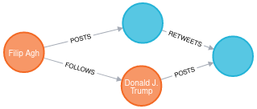

### autor: Filip Agh

### git: [link](https://github.com/filipagh/PDT-z6)

# uloha 1

vid docker compose

`docker exec [containerID] neo4j-admin load --from /tmp/dump --database=PDT --force --verbose`

# uloha 2

`match (a:Account)<-[f:FOLLOWS]-(t:Account)  return a.name, count(f) as followerCount order by followerCount desc limit 5
`

| name             | followerCount |
|-------------------|---------------|
| Barack Obama      | 12725         |
| KATY PERRY        | 11462         |
| Donald J. Trump   | 6735          |
| Kim Kardashian West | 6680          |
| Narendra Modi     | 6425          |

# uloha 3

`MATCH (start:Account{screen_name: "KimKardashian"}), (end:Account{screen_name: "katyperry"})
MATCH p=allShortestPaths((start)-[*]->(end))
RETURN p
`

<details>
  <summary>result</summary>

```
[
  {
    "p": {
"start": {
"identity": 41362,
"labels": [
          "Account"
        ],
"properties": {
"friends_count": 127,
"screen_name": "KimKardashian",
"statuses_count": 33006,
"followers_count": 66740871,
"name": "Kim Kardashian West",
"description": "Shop @kkwfragrance Diamonds II by Kourtney x Kim x Khloé now  & @SKIMS Sleep Naked Tuesday, 09.22 at 9AM PT",
"id": "25365536"
        }
      },
"end": {
"identity": 55286,
"labels": [
          "Account"
        ],
"properties": {
"friends_count": 224,
"screen_name": "katyperry",
"statuses_count": 10881,
"followers_count": 108521347,
"name": "KATY PERRY",
"description": "Love. Light.",
"id": "21447363"
        }
      },
"segments": [
        {
          "start": {
"identity": 41362,
"labels": [
              "Account"
            ],
"properties": {
"friends_count": 127,
"screen_name": "KimKardashian",
"statuses_count": 33006,
"followers_count": 66740871,
"name": "Kim Kardashian West",
"description": "Shop @kkwfragrance Diamonds II by Kourtney x Kim x Khloé now  & @SKIMS Sleep Naked Tuesday, 09.22 at 9AM PT",
"id": "25365536"
            }
          },
          "relationship": {
"identity": 1582667,
"start": 41362,
"end": 176822,
"type": "FOLLOWS",
"properties": {

            }
          },
          "end": {
"identity": 176822,
"labels": [
              "Account"
            ],
"properties": {
"friends_count": 261,
"screen_name": "janetronquilloo",
"statuses_count": 6430,
"followers_count": 276,
"name": "janet",
"description": "efm ♡ || scu ‘23",
"id": "2265291349"
            }
          }
        },
        {
          "start": {
"identity": 176822,
"labels": [
              "Account"
            ],
"properties": {
"friends_count": 261,
"screen_name": "janetronquilloo",
"statuses_count": 6430,
"followers_count": 276,
"name": "janet",
"description": "efm ♡ || scu ‘23",
"id": "2265291349"
            }
          },
          "relationship": {
"identity": 1148762,
"start": 176822,
"end": 32150,
"type": "FOLLOWS",
"properties": {

            }
          },
          "end": {
"identity": 32150,
"labels": [
              "Account"
            ],
"properties": {
"friends_count": 6686,
"screen_name": "PatsKarvelas",
"statuses_count": 105704,
"followers_count": 79970,
"name": "PatriciaKarvelas",
"description": "Presenter @RNDrive weekdays 6pm. @abcnews TV 4pm @abcnews TV 📺#afternoonbriefing #ThePartyRoom podcast + overbearing mother",
"id": "95091601"
            }
          }
        },
        {
          "start": {
"identity": 32150,
"labels": [
              "Account"
            ],
"properties": {
"friends_count": 6686,
"screen_name": "PatsKarvelas",
"statuses_count": 105704,
"followers_count": 79970,
"name": "PatriciaKarvelas",
"description": "Presenter @RNDrive weekdays 6pm. @abcnews TV 4pm @abcnews TV 📺#afternoonbriefing #ThePartyRoom podcast + overbearing mother",
"id": "95091601"
            }
          },
          "relationship": {
"identity": 2214410,
"start": 32150,
"end": 55286,
"type": "FOLLOWS",
"properties": {

            }
          },
          "end": {
"identity": 55286,
"labels": [
              "Account"
            ],
"properties": {
"friends_count": 224,
"screen_name": "katyperry",
"statuses_count": 10881,
"followers_count": 108521347,
"name": "KATY PERRY",
"description": "Love. Light.",
"id": "21447363"
            }
          }
        }
      ],
"length": 3.0
    }
  }
]
```
</details>


# uloha 4
`call{match x=(a:Account)-[p:POSTS]->(pt:Tweet)<-[r:RETWEETS]-(t:Tweet) return a, count(r) as c order by c desc limit 10} match (a)-[p:POSTS]->(pt:Tweet)<-[rr:RETWEETS]-(t:Tweet) return pt,a, count(rr) order by count(rr) limit 10`
<details>
  <summary>result</summary>


| tweet                                                                                                                                                                                                                                                                                                                                                                                                                                                      | acc                                                                                                                                                                                                                                                                                                               | retweet count |
|------------------------------------------------------------------------------------------------------------------------------------------------------------------------------------------------------------------------------------------------------------------------------------------------------------------------------------------------------------------------------------------------------------------------------------------------------------|-------------------------------------------------------------------------------------------------------------------------------------------------------------------------------------------------------------------------------------------------------------------------------------------------------------------|---------------|
| {"happened_at_str":2020-07-25 21:40:31+00,"favorite_count":4386,"id":1287140698131750913,"author_id":357606935,"content":Last night, the federal evictions moratorium expired, and rent is due next week—the same week coronavirus unemployment benefits are set to end.  This is a completely preventable crisis. Congress must act immediately to extend these critical protections.  https://t.co/9gALMcbR3k,"retweet_count":1571}                      | {"friends_count":561,"screen_name":ewarren,"statuses_count":10605,"followers_count":4650926,"name":Elizabeth Warren,"description":U.S. Senator, former teacher. Wife, mom (Amelia, Alex, Bailey, @CFPB), grandmother, and Okie. She/her. Official campaign account.,"id":357606935}                               | 1             |
| {"happened_at_str":2020-07-31 16:55:09+00,"favorite_count":547,"id":1289243214428303360,"author_id":68844197,"content":Este estudio en el @washingtonpost dice que para reabrir las universidades habría que hacer una prueba de Covid cada dos días a los alumnos https://t.co/69T4wIguXG,"retweet_count":219}                                                                                                                                            | {"friends_count":1895,"screen_name":CarlosLoret,"statuses_count":89899,"followers_count":8499134,"name":Carlos Loret de Mola,"description":Reportero. Columna #HistoriasDeReportero #AsíLasCosasConLoret en #WRadio. Colaborador del @WashingtonPost. @latinus_us,"id":68844197}                                  | 2             |
| {"happened_at_str":2020-07-29 19:17:34+00,"favorite_count":1262,"id":1288554276231548929,"author_id":22055226,"content":Lots of #FakeNews going around about this https://t.co/OQhHYZJZvh,"retweet_count":623}                                                                                                                                                                                                                                             | {"friends_count":746,"screen_name":replouiegohmert,"statuses_count":8349,"followers_count":344576,"name":Louie Gohmert,"description":Member of Congress, representing the first district of Texas which encompasses over 12 counties stretching nearly 120 miles down the eastern border of Texas.,"id":22055226} | 3             |
| {"happened_at_str":2020-07-31 17:43:51+00,"favorite_count":2493,"id":1289255470293757955,"author_id":357606935,"content":We know what we need to do to contain the virus and save lives and our economy—but Republicans refuse to invest enough in widespread testing and contact tracing.  Trump and his Republican buddies don’t have what it takes to get us out of this crisis. https://t.co/1CDbH26bmu,"retweet_count":722}                           | {"friends_count":561,"screen_name":ewarren,"statuses_count":10605,"followers_count":4650926,"name":Elizabeth Warren,"description":U.S. Senator, former teacher. Wife, mom (Amelia, Alex, Bailey, @CFPB), grandmother, and Okie. She/her. Official campaign account.,"id":357606935}                               | 3             |
| {"happened_at_str":2020-07-30 22:17:52+00,"favorite_count":3029,"id":1288962040401399815,"author_id":68844197,"content":Para morirse de envidia: cómo Francia está viviendo su nueva normalidad. Este articulista sale a restaurantes, va a conciertos y a centros comerciales. El truco: pruebas y rastreo de contactos. https://t.co/XcVG6T7E0P,"retweet_count":1164}                                                                                    | {"friends_count":1895,"screen_name":CarlosLoret,"statuses_count":89899,"followers_count":8499134,"name":Carlos Loret de Mola,"description":Reportero. Columna #HistoriasDeReportero #AsíLasCosasConLoret en #WRadio. Colaborador del @WashingtonPost. @latinus_us,"id":68844197}                                  | 6             |
| {"happened_at_str":2020-07-31 19:50:14+00,"favorite_count":1450,"id":1289287273880547328,"author_id":357606935,"content":We need to make sure schools have all the resources they need to determine whether and how to safely reopen. Anything less is recklessly endangering lives for political gain.  https://t.co/XVwGQ7yRF4,"retweet_count":359}                                                                                                      | {"friends_count":561,"screen_name":ewarren,"statuses_count":10605,"followers_count":4650926,"name":Elizabeth Warren,"description":U.S. Senator, former teacher. Wife, mom (Amelia, Alex, Bailey, @CFPB), grandmother, and Okie. She/her. Official campaign account.,"id":357606935}                               | 10            |
| {"happened_at_str":2020-08-01 00:17:02+00,"favorite_count":333,"id":1289354415372025858,"author_id":68844197,"content":688 fallecimientos documentados en 24 horas, ya son 46 mil 688 decesos por #Covid en #México. https://t.co/gh6x8hYCt2,"retweet_count":151}                                                                                                                                                                                          | {"friends_count":1895,"screen_name":CarlosLoret,"statuses_count":89899,"followers_count":8499134,"name":Carlos Loret de Mola,"description":Reportero. Columna #HistoriasDeReportero #AsíLasCosasConLoret en #WRadio. Colaborador del @WashingtonPost. @latinus_us,"id":68844197}                                  | 12            |
| {"happened_at_str":2020-08-01 04:27:42+00,"favorite_count":2295,"id":1289417499654541312,"author_id":68844197,"content":Murió Paco Valverde, un gran luchador por la naturaleza, valiente defensor de la Vaquita Marina. Hubo una enorme solidaridad para tratar de salvarlo. Gracias a todos los que estuvieron pendientes. Descanse en Paz el buen pescador. Abrazo entrañable para Alan y toda su familia. https://t.co/4nzviIbqto,"retweet_count":586} | {"friends_count":1895,"screen_name":CarlosLoret,"statuses_count":89899,"followers_count":8499134,"name":Carlos Loret de Mola,"description":Reportero. Columna #HistoriasDeReportero #AsíLasCosasConLoret en #WRadio. Colaborador del @WashingtonPost. @latinus_us,"id":68844197}                                  | 50            |
| {"happened_at_str":2020-07-30 23:23:28+00,"favorite_count":17852,"id":1288978547898322945,"author_id":2887547117,"content":2. You put employees at risk for getting sick. Yes we wear a mask, but we are there to serve you and have families and friends we are afraid to be around now because we don’t know how long ago we came in contact with someone or if we are infected until it’s too late.,"retweet_count":1120}                               | {"friends_count":265,"screen_name":maddieevelasco,"statuses_count":2123,"followers_count":643,"name":Mads,"description":,"id":2887547117}                                                                                                                                                                         | 54            |
| {"happened_at_str":2020-07-30 23:21:32+00,"favorite_count":23263,"id":1288978061501722625,"author_id":2887547117,"content":1. You put yourself at unnecessary risk of contracting covid-19. We sanitize as often as we can, but you still take your mask off to eat around strangers and you don’t know where they have been or who they have been in contact with.,"retweet_count":1331}                                                                  | {"friends_count":265,"screen_name":maddieevelasco,"statuses_count":2123,"followers_count":643,"name":Mads,"description":,"id":2887547117}                                                                                                                                                                         | 66            |


</details>


# uloha 5
`match (a:Account{screen_name:"realDonaldTrump"})-[p:POSTS]->(pt:Tweet)<-[r:RETWEETS]-(t:Tweet) with a, pt, count(r) as count order by count desc limit 1 create (myacc:Account{name: "Filip Agh", screen_name: "Filip Agh", id: "000000"})-[:FOLLOWS]->(a), (myacc)-[:POSTS]->(mytweet:Tweet)-[:RETWEETS]->(pt)  return pt, mytweet, a, myacc`


# uloha 6
`
match x=(main:Account{screen_name: "777stl"})-[:FOLLOWS]->(af:Account)<-[fc:FOLLOWS]-(tf:Account) where tf<>af  return  tf ,count(fc) order by count(fc) desc limit 10
`
<details>
  <summary>result</summary>

```
[
  {
    "tf": {
"identity": 223120,
"labels": [
        "Account"
      ],
"properties": {
"friends_count": 292,
"screen_name": "Aa43677901",
"statuses_count": 1135,
"followers_count": 35,
"name": "Aaحسين سعود بن رديفان",
"description": "",
"id": "1287346882000424963"
      }
    },
    "count(fc)": 2
  },
  {
    "tf": {
"identity": 72800,
"labels": [
        "Account"
      ],
"properties": {
"screen_name": "TuiteraActiva1",
"name": "💫❣️Tuitera❣️Activa1 💫",
"id": "1280570027922595840"
      }
    },
    "count(fc)": 1
  },
  {
    "tf": {
"identity": 86742,
"labels": [
        "Account"
      ],
"properties": {
"screen_name": "Steelersgirl690",
"name": "Cindy #GoodTrouble #RestinPower",
"id": "850170003349438466"
      }
    },
    "count(fc)": 1
  },
  {
    "tf": {
"identity": 272664,
"labels": [
        "Account"
      ],
"properties": {
"friends_count": 1622,
"screen_name": "acacciatore94",
"statuses_count": 47631,
"followers_count": 1176,
"name": "Alessia Cacciatore",
"description": "Another day. The walls are built to keep me safe. I can't escape. It's too late. 
Instagram: alessia_cacciatore_  
Slfl Verona 13.05.2016
MYT Milano 17.11.2018",
"id": "208018994"
      }
    },
    "count(fc)": 1
  },
  {
    "tf": {
"identity": 298849,
"labels": [
        "Account"
      ],
"properties": {
"friends_count": 44,
"screen_name": "jassar_gurjant",
"statuses_count": 65,
"followers_count": 38,
"name": "ਤਾਇਆ।। 🧔🏻",
"description": "Software Engineer | Trekker | Poet | 

ਜੇ ਤੌੜੂ ਜਿੰਦਗੀ ਲੱਖ ਵਾਰੀ,  ਲੱਖ ਵਾਰੀ ਜੁੜ ਕੇ ਆਵਾਂਗੇ ! 🔝",
"id": "1277279184390287361"
      }
    },
    "count(fc)": 1
  },
  {
    "tf": {
"identity": 87575,
"labels": [
        "Account"
      ],
"properties": {
"friends_count": 49,
"screen_name": "moesnaps78",
"statuses_count": 65815,
"followers_count": 103,
"name": "Maurice C. Pritchett",
"description": "Avid Husky, Seahawks, Supersonics, Mariners fan!!!
#BringBackMySuperSonics",
"id": "343595581"
      }
    },
    "count(fc)": 1
  },
  {
    "tf": {
"identity": 206505,
"labels": [
        "Account"
      ],
"properties": {
"friends_count": 568,
"screen_name": "ACrowdedPlanet",
"statuses_count": 9875,
"followers_count": 363,
"name": "🌍 TheWeepingEarth",
"description": "Poking hornets' nests.

We will not be silenced.",
"id": "832249908300230656"
      }
    },
    "count(fc)": 1
  },
  {
    "tf": {
"identity": 192168,
"labels": [
        "Account"
      ],
"properties": {
"friends_count": 789,
"screen_name": "heruyaheru",
"statuses_count": 42083,
"followers_count": 2881,
"name": "Heru Prasetia",
"description": "Penggemar Barca dan hal-hal baik lainnya, nge-tweet apa saja kecuali hal penting.",
"id": "55969790"
      }
    },
    "count(fc)": 1
  },
  {
    "tf": {
"identity": 304358,
"labels": [
        "Account"
      ],
"properties": {
"friends_count": 189,
"screen_name": "han0110if",
"statuses_count": 2413,
"followers_count": 133,
"name": "Han If",
"description": "Thank you for making me laugh when I'd almost forgotten how to.",
"id": "3159391915"
      }
    },
    "count(fc)": 1
  },
  {
    "tf": {
"identity": 150017,
"labels": [
        "Account"
      ],
"properties": {
"friends_count": 1149,
"screen_name": "Anonymous5426",
"statuses_count": 40511,
"followers_count": 1093,
"name": "Anonymous | گمنام",
"description": "Student | Introvert | Free Thinker | Constitutionalist | Not Affiliated With Any Social/Political Party | RT's Not Endorsement |",
"id": "1223311137900572673"
      }
    },
    "count(fc)": 1
  }
]
```
</details>


# uloha 7 

`match x=(af:Account)<-[:FOLLOWS]-(dw:Account{screen_name: "DaynerWilson"})-[:POSTS]-(:Tweet)-[:RETWEETS*]-(:Tweet)<-[ct:RETWEETS]-(:Tweet)<-[:POSTS]-(tf:Account) where af <> tf return  tf, count(ct) order by count(ct) desc limit 10`
<details>
  <summary>result</summary>

```
[
  {
    "count(ct)": 9,
    "tf": {
"identity": 261154,
"labels": [
        "Account"
      ],
"properties": {
"friends_count": 3,
"screen_name": "GusRodr05589737",
"statuses_count": 393,
"followers_count": 4,
"name": "Gus Rodriguez",
"description": "simple",
"id": "1246675162717491204"
      }
    }
  },
  {
    "count(ct)": 9,
    "tf": {
"identity": 174398,
"labels": [
        "Account"
      ],
"properties": {
"friends_count": 12,
"screen_name": "Aquilesreyes9",
"statuses_count": 330,
"followers_count": 1,
"name": "Aquilesreyes",
"description": "",
"id": "1246647610879795202"
      }
    }
  },
  {
    "count(ct)": 9,
    "tf": {
"identity": 57454,
"labels": [
        "Account"
      ],
"properties": {
"friends_count": 507,
"screen_name": "GoretiLiza",
"statuses_count": 23768,
"followers_count": 577,
"name": "goreti josefina liza",
"description": "Mtria. en Pedagogía, Mtria. en Política y Gestión Pública, Lic. Educ. Prim. y Secundaria, Secretario de Innovación y Reingenieria Organizativa del CEN del SNTE",
"id": "1688430068"
      }
    }
  },
  {
    "count(ct)": 6,
    "tf": {
"identity": 90699,
"labels": [
        "Account"
      ],
"properties": {
"friends_count": 13,
"screen_name": "BetyRod50219672",
"statuses_count": 826,
"followers_count": 14,
"name": "Bety Rodriguez",
"description": "Profesora SNTE sección 1 preescolar",
"id": "1247338058661408769"
      }
    }
  },
  {
    "count(ct)": 3,
    "tf": {
"identity": 122661,
"labels": [
        "Account"
      ],
"properties": {
"friends_count": 61,
"screen_name": "CCARSOLIOO",
"statuses_count": 990,
"followers_count": 10,
"name": "GUILLERMO ROMERO",
"description": "",
"id": "186609803"
      }
    }
  },
  {
    "count(ct)": 3,
    "tf": {
"identity": 219567,
"labels": [
        "Account"
      ],
"properties": {
"friends_count": 75,
"screen_name": "elizagomalcala",
"statuses_count": 6634,
"followers_count": 68,
"name": "elizabeth",
"description": "",
"id": "2371169797"
      }
    }
  },
  {
    "count(ct)": 3,
    "tf": {
"identity": 37910,
"labels": [
        "Account"
      ],
"properties": {
"friends_count": 4992,
"screen_name": "viralvideovlogs",
"statuses_count": 313950,
"followers_count": 3906,
"name": "#StayHome",
"description": "news news news and trends

https://t.co/2ScZqTGWgG",
"id": "952247125185720320"
      }
    }
  }
]
```
</details>


# uloha 8
povodne query 
```
match (a:Account)-[:POSTS]->(t:Tweet{id: '1289380305728503808'}) 
optional match z=(la:Account)-[:FOLLOWS*..5]->(a:Account) 
optional match (la:Account)-[:POSTS]->(lf:Tweet) 
with lf,t,apoc.text.split(t.content, ' ') as tcont  
where not (lf)-[:RETWEETS]-(t) RETURN lf, size(apoc.coll.intersection(apoc.text.split(lf.content, ' '),tcont)) as words 
order by words desc limit 5
```

obohatene o toLower a odstranenie stopwords (dufam v bonusovy bodik :) )

```
LOAD CSV FROM "file:///stopwords" AS row 
match (a:Account)-[:POSTS]->(t:Tweet{id: '1289380305728503808'}) 
optional match z=(la:Account)-[:FOLLOWS*..5]->(a:Account) 
optional match (la:Account)-[:POSTS]->(lf:Tweet) 
with lf,t,apoc.coll.subtract(apoc.text.split(toLOWER(t.content), ' '),row) as tcont  
where not (lf)-[:RETWEETS]-(t) 
RETURN  
 lf.id, 
 size(apoc.coll.intersection(apoc.text.split(toLOWER(lf.content), ' '),tcont)) as words,
 apoc.coll.intersection(apoc.text.split(toLOWER(lf.content), ' '),tcont) as intersect,
 tcont as main_tweet  
order by words desc limit 5
```

| tweetID             |words|intersect            |main_tweet                                                                                                                                                                                                    |
|---------------------|-----|---------------------|--------------------------------------------------------------------------------------------------------------------------------------------------------------------------------------------------------------|
| 1289381114927177729 |3    |[covid,state’s,every]|[covid,allowed,helping,@dougducey,virus,economically,@senmcsallyaz,came,communities,,every,decision,state’s,economy,,made,unemployed.,regarding,ravage,actually,adandonded,@eturleye,@jaderhinos,yet,,driven,]|
| 1289429206942662656 |2    |[covid,came]         |[covid,allowed,helping,@dougducey,virus,economically,@senmcsallyaz,came,communities,,every,decision,state’s,economy,,made,unemployed.,regarding,ravage,actually,adandonded,@eturleye,@jaderhinos,yet,,driven,]|
| 1289391995228692480 |1    |[covid]              |[covid,allowed,helping,@dougducey,virus,economically,@senmcsallyaz,came,communities,,every,decision,state’s,economy,,made,unemployed.,regarding,ravage,actually,adandonded,@eturleye,@jaderhinos,yet,,driven,]|
| 1289389259145674753 |1    |[covid]              |[covid,allowed,helping,@dougducey,virus,economically,@senmcsallyaz,came,communities,,every,decision,state’s,economy,,made,unemployed.,regarding,ravage,actually,adandonded,@eturleye,@jaderhinos,yet,,driven,]|
| 1289440472734134272 |1    |[covid]              |[covid,allowed,helping,@dougducey,virus,economically,@senmcsallyaz,came,communities,,every,decision,state’s,economy,,made,unemployed.,regarding,ravage,actually,adandonded,@eturleye,@jaderhinos,yet,,driven,]|

# uloha bonus

prva query ale nemyslim si ze je to ok
`
MATCH (start:Account{screen_name: "katyperry"}), (end:Account{screen_name: "realDonaldTrump"})
MATCH p=allShortestPaths((start)-[:POSTS|RETWEETS*]-(end))
RETURN p
`

query na vbytvorenie temp hran ktore vyhovuju chain relationship
`
match x=(start:Account)-[:POSTS]-(:Tweet)-[:RETWEETS]->(tt:Tweet)-[:POSTS]-(end:Account) 
merge (start)-[:TEMP]->(end) 
return x limit 10
`

query na jednoduche hladanie cez allShortestPaths rekurzivne v konkretnej relationshipe
`
MATCH (start:Account{screen_name: "katyperry"}), (end:Account{screen_name: "realDonaldTrump"}) 
MATCH p=allShortestPaths((start)-[:TEMP*]->(end)) 
RETURN p
`


<details>
  <summary>result</summary>

```
[
  {
    "p": {
"start": {
"identity": 55286,
"labels": [
          "Account"
        ],
"properties": {
"friends_count": 224,
"screen_name": "katyperry",
"statuses_count": 10881,
"followers_count": 108521347,
"name": "KATY PERRY",
"description": "Love. Light.",
"id": "21447363"
        }
      },
"end": {
"identity": 29616,
"labels": [
          "Account"
        ],
"properties": {
"friends_count": 50,
"screen_name": "realDonaldTrump",
"statuses_count": 56081,
"followers_count": 86091475,
"name": "Donald J. Trump",
"description": "45th President of the United States of America🇺🇸",
"id": "25073877"
        }
      },
"segments": [
        {
          "start": {
"identity": 55286,
"labels": [
              "Account"
            ],
"properties": {
"friends_count": 224,
"screen_name": "katyperry",
"statuses_count": 10881,
"followers_count": 108521347,
"name": "KATY PERRY",
"description": "Love. Light.",
"id": "21447363"
            }
          },
          "relationship": {
"identity": 2471661,
"start": 55286,
"end": 676208,
"type": "TEMP",
"properties": {

            }
          },
          "end": {
"identity": 676208,
"labels": [
              "Account"
            ],
"properties": {
"screen_name": "unrealDonaldTrump"
            }
          }
        },
        {
          "start": {
"identity": 676208,
"labels": [
              "Account"
            ],
"properties": {
"screen_name": "unrealDonaldTrump"
            }
          },
          "relationship": {
"identity": 2315749,
"start": 676208,
"end": 29616,
"type": "TEMP",
"properties": {

            }
          },
          "end": {
"identity": 29616,
"labels": [
              "Account"
            ],
"properties": {
"friends_count": 50,
"screen_name": "realDonaldTrump",
"statuses_count": 56081,
"followers_count": 86091475,
"name": "Donald J. Trump",
"description": "45th President of the United States of America🇺🇸",
"id": "25073877"
            }
          }
        }
      ],
"length": 2.0
    }
  }
]
```
</details>
